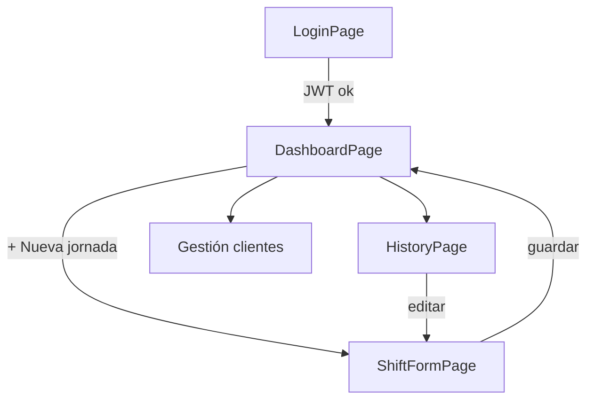

# HorarioPro — Tareas frontend (MVP)

Documento de planificación para la capa UI del MVP. Stack objetivo: **React 18+**, **Vite**, **Tailwind CSS**, **PWA** instalable, diseño **mobile-first**.

## Objetivos de producto (UI)

| Objetivo | Criterio medible |
|----------|------------------|
| Registro rápido de jornada | Completar alta de jornada en **< 10 s** y **< 5 acciones** (tap/controles) desde Dashboard |
| Visibilidad inmediata | Dashboard muestra hoy / semana / mes, dinero estimado, extras de conducción, últimas jornadas |
| Gestión de clientes | CRUD con nombre, color identificativo y tarifa horaria opcional |
| Sesión persistente | JWT almacenado de forma segura; rehidratación al abrir la app sin re-login innecesario |

## Vistas del MVP

| Ruta (propuesta) | Vista | Rol |
|------------------|-------|-----|
| `/login` | Login | Autenticación |
| `/` o `/dashboard` | Dashboard | Hub principal + CTA jornada |
| `/jornada/nueva`, `/jornada/:id` | Crear / Editar jornada | Formulario rápido |
| `/historial` | Historial | Listado y filtros de jornadas pasadas |

---

## Mapa de páginas y componentes

### Páginas (`src/pages/`)

| Página | Responsabilidad |
|--------|-----------------|
| `LoginPage` | Formulario email/contraseña, errores API, redirect si ya autenticado |
| `DashboardPage` | KPIs, últimas jornadas, FAB/CTA «+ Nueva jornada», acceso a clientes e historial |
| `ShiftFormPage` | Alta/edición jornada (cliente, fechas/horas, extras conducción, notas mínimas) |
| `HistoryPage` | Lista paginada o por rango; tap → editar jornada |

### Layout y navegación

| Componente | Uso |
|------------|-----|
| `AppShell` | Layout mobile: header, contenido, bottom nav (Dashboard / Historial / Ajustes o Clientes) |
| `ProtectedRoute` | Guard de rutas con estado de auth |
| `BottomNav` | Navegación principal 3–4 ítems, thumb-friendly |

### Componentes de dominio (`src/components/`)

| Componente | Uso |
|------------|-----|
| `StatCard` | Bloque KPI (horas hoy/semana/mes, € estimado) |
| `DrivingExtrasSummary` | Resumen extras conducción (periodo activo del dashboard) |
| `ShiftList` | Lista compacta de jornadas recientes |
| `ShiftListItem` | Fila: cliente (color), horas, fecha, importe estimado |
| `ShiftQuickForm` | Campos esenciales del formulario rápido |
| `ClientSelect` | Selector con color/badge; enlace a crear cliente inline si vacío |
| `ClientForm` | Modal o pantalla: nombre, color picker, tarifa opcional |
| `ClientList` | Lista para gestión CRUD |
| `ColorPicker` | Paleta predefinida + input hex opcional |
| `MoneyDisplay` | Formato moneda local consistente |
| `DurationDisplay` | Horas decimales / `HH:mm` según convención API |
| `EmptyState` | Sin jornadas / sin clientes |
| `LoadingSpinner` / `SkeletonBlock` | Estados de carga |
| `ErrorBanner` | Errores de red o validación global |

### Infraestructura frontend (`src/`)

| Módulo | Responsabilidad |
|--------|-----------------|
| `services/apiClient.ts` | Axios/fetch: base URL, interceptors JWT, refresh si aplica |
| `services/authService.ts` | login, logout, me |
| `services/shiftService.ts` | CRUD jornadas, agregados dashboard |
| `services/clientService.ts` | CRUD clientes |
| `hooks/useAuth.ts` | Sesión, login/logout, `isAuthenticated` |
| `hooks/useDashboard.ts` | KPIs + últimas jornadas |
| `hooks/useShifts.ts` | Lista historial, mutaciones |
| `hooks/useClients.ts` | Lista clientes, cache invalidation |
| `context/AuthContext.tsx` | Proveedor de sesión (opcional si hooks + query bastan) |
| `utils/storage.ts` | Persistencia token (ver preguntas abiertas) |
| `utils/money.ts` / `utils/time.ts` | Cálculos UI alineados con contrato API |

### Diagrama de flujo (alto nivel)



---

## Convenciones de estimación

- **S** = 0,5–1 día · **M** = 1–2 días · **L** = 2–3 días  
- Estimaciones asumen API disponible según contrato acordado con backend.  
- IDs: `FE-XXX` (orden sugerido de implementación).

---

## Fase 1 — Scaffold y fundaciones

| ID | Tarea | Criterios de aceptación | Dependencias | Est. |
|----|-------|-------------------------|--------------|------|
| FE-001 | Inicializar proyecto Vite + React + TypeScript | `npm run dev` arranca; estructura `src/{pages,components,hooks,services,utils}`; ESLint/Prettier alineados con repo | — | S |
| FE-002 | Configurar Tailwind (mobile-first) | Breakpoints documentados; tokens básicos (spacing, tipografía, colores semánticos); contenedor max-width en desktop | FE-001 | S |
| FE-003 | Router y rutas base | React Router: `/login`, `/dashboard`, `/jornada/nueva`, `/jornada/:id`, `/historial`; redirect `/` → dashboard | FE-001 | S |
| FE-004 | Capa API (`apiClient`) | Base URL por env (`VITE_API_URL`); header `Authorization: Bearer`; manejo 401 global (logout o refresh según decisión) | FE-001 | M |
| FE-005 | `AppShell` + `BottomNav` | Navegación visible solo en rutas autenticadas; áreas táctiles ≥ 44px; safe-area iOS | FE-002, FE-003 | M |
| FE-006 | Componentes UI base | `Button`, `Input`, `Label`, `Card`, `Modal`/`Sheet` móvil, estados disabled/loading | FE-002 | M |

---

## Fase 2 — Autenticación (UI + sesión)

| ID | Tarea | Criterios de aceptación | Dependencias | Est. |
|----|-------|-------------------------|--------------|------|
| FE-010 | `authService` + `useAuth` | `login(credentials)` guarda JWT; `logout()` limpia storage y estado; `getMe()` valida sesión al boot | FE-004 | M |
| FE-011 | Persistencia JWT | Token persiste entre recargas; no se expone en URL; logout borra todo rastro local | FE-010 | S |
| FE-012 | `LoginPage` | Validación cliente (campos requeridos); mensajes error API; loading en submit; accesible (labels, focus) | FE-006, FE-010 | M |
| FE-013 | `ProtectedRoute` | Usuario no autenticado → `/login`; autenticado en `/login` → `/dashboard` | FE-003, FE-010 | S |
| FE-014 | Pantalla de carga inicial | Splash o skeleton mientras se resuelve `getMe()`; sin flash de login/dashboard incorrecto | FE-010, FE-013 | S |

---

## Fase 3 — Dashboard

| ID | Tarea | Criterios de aceptación | Dependencias | Est. |
|----|-------|-------------------------|--------------|------|
| FE-020 | `shiftService.getDashboardSummary` + `useDashboard` | Consume endpoint(s) de agregados: horas hoy/semana/mes, € estimado, extras conducción | FE-004, API dashboard | M |
| FE-021 | `DashboardPage` — KPIs | Tres `StatCard` de horas + tarjeta dinero estimado; skeleton en carga; error recuperable | FE-020, FE-006 | M |
| FE-022 | `DrivingExtrasSummary` | Muestra total/unidades de extras conducción del periodo (definido por API) | FE-020 | S |
| FE-023 | `ShiftList` — últimas jornadas | ≥ 5 últimas o «ver todo» → historial; cada ítem con color cliente y horas | FE-020 | M |
| FE-024 | CTA «+ Nueva jornada» | Botón prominente (FAB o banner fijo); un tap → `/jornada/nueva` | FE-003, FE-021 | S |
| FE-025 | Estados vacío y error | `EmptyState` si no hay jornadas; reintento en fallo de red | FE-021 | S |

---

## Fase 4 — Crear / editar jornada (flujo < 10 s)

| ID | Tarea | Criterios de aceptación | Dependencias | Est. |
|----|-------|-------------------------|--------------|------|
| FE-030 | `ShiftFormPage` — campos MVP | Cliente (obligatorio), fecha, hora inicio/fin o duración, toggle/input extras conducción; valores por defecto inteligentes (hoy, último cliente) | FE-006, FE-004 | L |
| FE-031 | `ClientSelect` integrado | Lista clientes activos; creación rápida inline o link a gestión si lista vacía | FE-050 (parcial) o mock | M |
| FE-032 | Guardar / actualizar jornada | POST en nueva; PUT en edición; toast o feedback; vuelta a dashboard con lista actualizada | FE-030, API shifts | M |
| FE-033 | Validación y UX rápida | Errores inline; submit deshabilitado si inválido; **flujo medido ≤ 5 acciones** con defaults (documentar en README interno) | FE-030 | M |
| FE-034 | Edición desde historial | `/jornada/:id` precarga datos; mismos criterios que alta | FE-030, FE-060 | S |

**Definición de «5 acciones» (objetivo UX):**  
1) Tap «+ Nueva jornada» → 2) Confirmar/seleccionar cliente (o aceptar default) → 3) Ajustar fin de jornada si difiere del default → 4) Opcional: extra conducción → 5) Guardar.

---

## Fase 5 — Historial

| ID | Tarea | Criterios de aceptación | Dependencias | Est. |
|----|-------|-------------------------|--------------|------|
| FE-040 | `useShifts` — listado | Paginación o scroll infinito; filtros mínimos: rango fechas o mes actual | FE-004, API list | M |
| FE-041 | `HistoryPage` | Lista agrupada por día (opcional); pull-to-refresh en móvil si viable | FE-040, FE-023 | M |
| FE-042 | Navegación a edición | Tap en ítem → `/jornada/:id` | FE-034, FE-041 | S |
| FE-043 | Búsqueda / filtro cliente (opcional MVP+) | Si API lo soporta; si no, dejar hook preparado | FE-040 | S |

---

## Fase 6 — Gestión de clientes

| ID | Tarea | Criterios de aceptación | Dependencias | Est. |
|----|-------|-------------------------|--------------|------|
| FE-050 | `clientService` + `useClients` | list, create, update, delete; invalidación cache tras mutación | FE-004, API clients | M |
| FE-051 | `ClientList` + acceso desde dashboard o ajustes | Lista con swatch de color; acciones editar/eliminar con confirmación | FE-050, FE-006 | M |
| FE-052 | `ClientForm` | Campos: nombre (req), color (req), tarifa horaria (opcional, numérico ≥ 0); validación | FE-050 | M |
| FE-053 | Eliminar cliente | Confirmación; manejo error si tiene jornadas asociadas (mensaje API) | FE-051 | S |
| FE-054 | Uso de color en UI | `ShiftListItem`, `ClientSelect` y dashboard usan color del cliente de forma consistente | FE-051, FE-023 | S |

---

## Fase 7 — PWA y pulido mobile

| ID | Tarea | Criterios de aceptación | Dependencias | Est. |
|----|-------|-------------------------|--------------|------|
| FE-060 | Manifest + iconos | `manifest.webmanifest`, theme-color, iconos 192/512; nombre «HorarioPro» | FE-001 | S |
| FE-061 | Service Worker (vite-plugin-pwa) | Estrategia: app shell cache; API network-first; instalable en Android/iOS (Add to Home) | FE-060 | M |
| FE-062 | Meta viewport y safe areas | Sin zoom accidental en inputs; `env(safe-area-inset-*)` en shell | FE-005 | S |
| FE-063 | Offline degradado | Banner «sin conexión»; formulario no envía sin red; lectura cacheada solo si API lo permite | FE-061 | M |
| FE-064 | Lighthouse móvil (objetivo) | PWA installable; Performance y Accessibility ≥ 90 en página dashboard (aspiracional MVP) | FE-061 | S |

---

## Fase 8 — Integración, pruebas y entrega

| ID | Tarea | Criterios de aceptación | Dependencias | Est. |
|----|-------|-------------------------|--------------|------|
| FE-070 | Variables de entorno documentadas | `.env.example` con `VITE_API_URL`; README sección frontend | FE-004 | S |
| FE-071 | Pruebas smoke (opcional MVP) | Vitest + Testing Library: `LoginPage` submit, `ProtectedRoute` redirect | FE-012 | M |
| FE-072 | Build producción | `npm run build` sin errores; assets hashed; preview Caddy/nginx según despliegue | Todas fases | S |
| FE-073 | Revisión flujo crítico E2E manual | Checklist: login → dashboard → nueva jornada < 10 s → historial → editar → CRUD cliente | FE-024–FE-054 | S |

---

## Resumen de dependencias entre fases

```text
Fase 1 (scaffold) → Fase 2 (auth) → Fase 3 (dashboard)
                              ↘
Fase 6 (clientes) ─────────→ Fase 4 (jornada) → Fase 5 (historial)
                              ↘
                        Fase 7 (PWA) — en paralelo desde Fase 3
```

---

## Preguntas abiertas

| # | Tema | Opciones / impacto |
|---|------|-------------------|
| Q1 | Almacenamiento JWT | `localStorage` (simple) vs `sessionStorage` vs cookie httpOnly (requiere backend). Impacto XSS vs conveniencia PWA. |
| Q2 | Refresh token | ¿Endpoint refresh? Si no, 401 → login silencioso vs modal. |
| Q3 | Modelo de jornada | ¿Duración vs inicio/fin? ¿Jornadas que cruzan medianoche? Afecta formulario y validación. |
| Q4 | Extras de conducción | ¿Unidad (km, viajes, € fijo)? ¿Por jornada o acumulado en dashboard? |
| Q5 | Cálculo de dinero estimado | ¿Frontend calcula con tarifa cliente × horas o solo muestra campo API? Fuente de verdad. |
| Q6 | Moneda y locale | ¿EUR fijo? ¿`Intl` según navegador? |
| Q7 | Eliminar cliente con jornadas | ¿Bloqueo, soft-delete o desvincular? Mensajes UI. |
| Q8 | Gestión clientes — UX | ¿Pantalla dedicada `/clientes` o modal desde dashboard? ¿En bottom nav? |
| Q9 | Offline | ¿Solo lectura cacheada o cola de escrituras (complejidad alta)? |
| Q10 | Autenticación futura | ¿Registro, recuperar contraseña, OAuth? Fuera MVP pero rutas no deben impedirlo. |
| Q11 | Contrato API | ¿OpenAPI disponible para generar tipos (`openapi-typescript`)? |
| Q12 | Accesibilidad | ¿Nivel objetivo WCAG AA completo o pragmático (contraste, focus, labels)? |

---

## Referencias cruzadas

- README producto: [../../README.md](../../README.md)
- Backend / API: documentar en `docs/pliego/01-backend-tareas.md` (cuando exista) — alinear endpoints con `shiftService` y `clientService` de este documento.

---

*Última actualización: planificación MVP — sin código en repo aún.*
